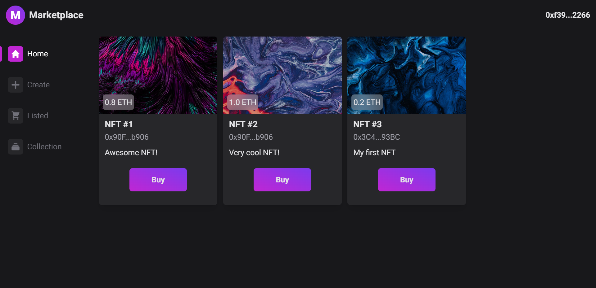
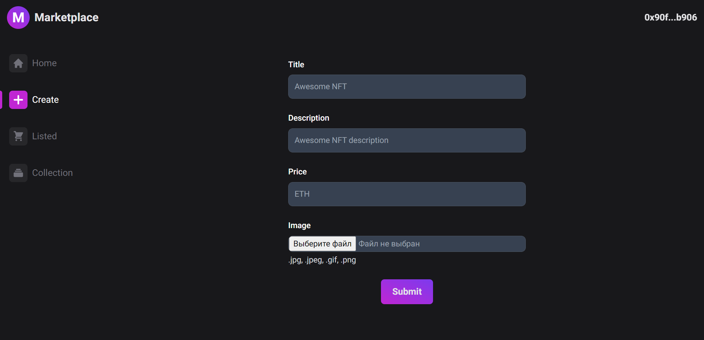
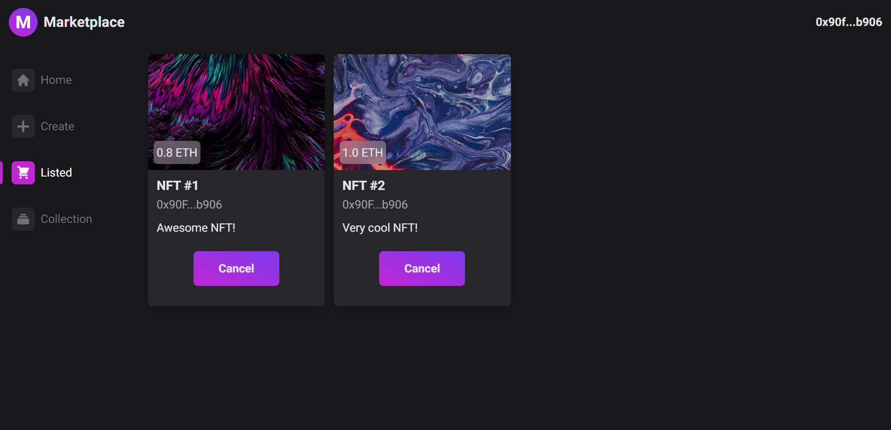
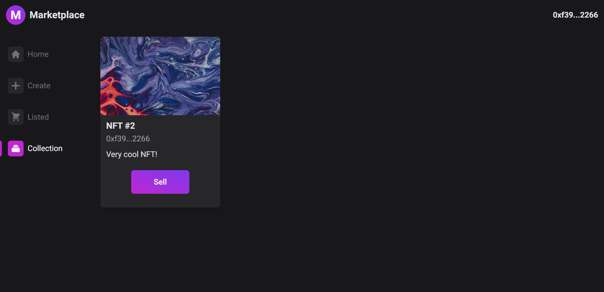

# NFT Marketplace

## Technologies & Tools
- Vite
- React
- React Router
- Tailwind CSS
- Solidity
- Ethers
- Hardhat
- IPFS

## Screenshots



<br/>



## Setting Up
### 1. Clone/Download

### 2. Install dependencies
`npm install`

### 3. Run local development blockchain
`npx hardhat node`

### 4. Import development blockchain account to Metamask

### 5. Migrate smart contracts
`npx hardhat run hardhat/scripts/deploy.js --network localhost`

### 6. Run tests
`npx hardhat test`

### 7. Run IPFS

Initializing:
`npx ipfs init`

Configuration:
```
npx ipfs config Addresses.API /ip4/127.0.0.1/tcp/5001
npx ipfs config --json API.HTTPHeaders.Access-Control-Allow-Origin '[\"*\"]'
npx ipfs config --json API.HTTPHeaders.Access-Control-Allow-Methods '[\"GET\", \"POST\"]'
npx ipfs config --json API.HTTPHeaders.Access-Control-Allow-Credentials '[\"true\"]'
```

Start daemon:
`npx ipfs daemon`

### 8. Launch local server
`npm run dev`

Open [http://localhost:5173](http://localhost:5173) to view it in your browser.
